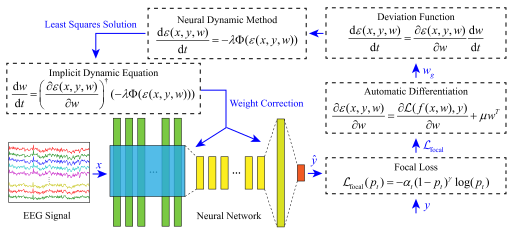

# ConvDCDNN

Open source code for paper *Convolutional Dynamically Convergent Differential Neural Network for Brain Signal Classification*

---



---

## Dataset

We use the datasets from the BCI Competition.

- [BCI Competition 2003](https://www.bbci.de/competition/ii/)

- [BCI Competition III](https://www.bbci.de/competition/iii/)

These datasets contain EEG data recorded from 64 electrodes placed on the scalp of subjects, sampled at a rate of 240 Hz. The original datasets are in MATLAB format. To simplify the data processing, we pre-converted the datasets into [HDF5](https://en.wikipedia.org/wiki/Hierarchical_Data_Format) format and segmented the EEG signals into samples of length 7794 (i.e. 32.475 seconds) per trial. The HDF5 files have been split into 40MB chunks and uploaded to the `data` directory.

Upon the first run, these split files will be automatically merged. Alternatively, you can manually merge them using the following command.

```bash
cat data/dataset.hdf5.part_* > data/dataset.hdf5
```

## Preprocessing

Our preprocessing is fairly straightforward, consisting only of band-pass filtering and z-score normalization. For details, please refer to the [`preprocess.py`](preprocess.py) file.

## Model

Please refer to the [`model.py`](model.py).

## Training

We use the popular [PyTorch](https://pytorch.org/) framework for training. To utilize PyTorch's standard training workflow, we extend the `torch.utils.data.dataset.Dataset` class and use `torch.utils.data.DataLoader` to load the datasets. For details, please refer to the [`dataset.py`](dataset.py) file.

During training, we used the proposed ADCL optimizer. ADCL is not much different from other optimizers in Torch, except that it requires passing the loss through a closure during training. Additionally, we used `tensorboard` to track the changes in metrics during the training process. You can view this data using the following command.

```bash
tensorboard --logdir=runs
```

The training results will be saved in the `result` folder, and you can also manually specify the folder using the `--result-path` parameter.

For details on the training process, please refer to [`train.py`](train.py).

```bash
python train.py --help
```

## Explainability

For details, please refer to the [`grad_cam.py`](grad_cam.py) file.
